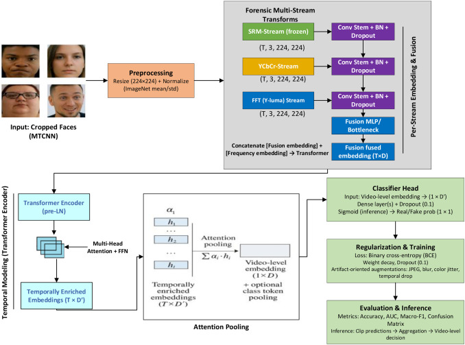

# VIDS-Guard
This repository contains the code for robust video deepfake detection(https://doi.org/10.1016/j.iswa.2026.200664). The proposed framework uses complementary forensic signals from multiple streams to capture manipulation artefacts that are often missed by single-stream models. The code operationalises the academic contributions by implementing a novel forensics aware multi stream architecture that embeds SRM residual filtering, YCbCr colour decomposition, and FFT spectral embeddings within a temporal transformer for video level deepfake detection. It also realises a unified forensic representation that combines residual, chromatic, spectral, and temporal evidence to improve robustness under compression, manipulation diversity, and domain shift. In addition, the repository supports the paper’s comparative evaluation framework against six benchmark architectures, its ablation setting for quantifying the contribution of each forensic stream and temporal modelling component, and its reproducible experimental pipeline built around the VIDS Guard dataset and unseen external evaluation setting. Taken together, the repository reflects the paper’s core claim that explicit forensic modelling, rather than semantic recognition alone, is essential for robust and generalisable deepfake video detection in real world multimedia security applications.

  

VIDS-Guard is a forensics-aware deepfake video detection framework and benchmark dataset designed for robust cross-dataset generalization. The repository provides the full training and evaluation pipeline for the VIDS-Guard model, alongside scripts for dataset preprocessing and face extraction.

The accompanying **VIDS-Guard Dataset (v1.0)** comprises **26,975 videos** (13,487 real / 13,488 fake) aggregated from eleven public benchmarks, covering identity swap, expression reenactment, full synthesis, and compression-based manipulations.

This repository **does not host any video data**. All datasets are publicly available and released via Zenodo.
## Dataset Availability

- **VIDS-Guard Dataset (v1.0 – Part 1: Training / Validation / Test)**  
  Asif, S., & Alanazi, S. (2025). VIDS-Guard Dataset (v1.0, Part 1 of 2) (Version 1) [Data set]. Zenodo. https://doi.org/10.5281/zenodo.17362749

- **VIDS-Guard Dataset (v1.0 – Part 2: External Unseen Test Set)**  
  Alanazi, S., & Asif, S. (2025). VIDS-Guard Dataset (v1.0, Part 2 of 2) (Version 1) [Data set]. Zenodo. https://doi.org/10.5281/zenodo.17382113
> This repository provides code and preprocessing workflows only; users must download datasets directly from the original sources or Zenodo.
